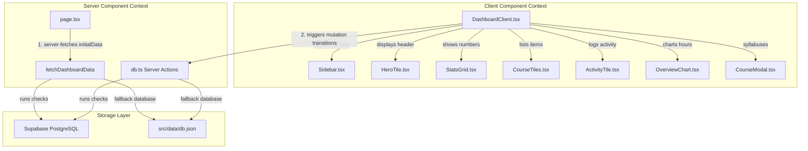

# Next-Gen Learning Dashboard

An interactive, premium learning dashboard built with Next.js 16, React 19, Supabase, Framer Motion, and Tailwind CSS v4.

---

## Architectural Choices

The project’s architecture centers around speed, visual aesthetics, and reliability. Key technical decisions include:

### 1. Unified Stack: Next.js 16 + React 19

- **App Router**: Leveraged Next.js 16's file-system routing structure for page routing.
- **Server Components & Server Actions**: Leveraged React 19's native handling of Server Actions for direct database updates (`use server`) and Server Components for server-side initial data fetching.

### 2. Dual-Layer Database Architecture (Supabase + Local JSON Fallback)

- **Supabase integration**: Connects to a Supabase Postgres instance via the client wrapper in [`supabase.ts`](file:///Users/Yatharth/Documents/Project-Code/learning-dashboard/src/lib/supabase.ts).
- **Graceful degradation**: If Supabase credentials are not found (or remain placeholders), the system automatically degrades to a local JSON file-based database ([`db.json`](file:///Users/Yatharth/Documents/Project-Code/learning-dashboard/src/data/db.json)) managed using Node's filesystem module in [`db.ts`](file:///Users/Yatharth/Documents/Project-Code/learning-dashboard/src/lib/db.ts).

### 3. Visual System: Tailwind CSS v4 + Framer Motion

- **Premium Aesthetics**: Created a sleek, custom dark UI featuring glassmorphic borders, dynamic grids, and custom bento card layouts.
- **Interactive Micro-Animations**: Used Framer Motion to animate entry lists, handle layout transitions, manage responsive sidebar adjustments, and provide a premium popup experience for the course syllabus details.

---

## Server/Client Component Split

To maximize performance, SEO, and user interaction, the component hierarchy divides duties between Server and Client components:



### Server Components

- **[`page.tsx`](file:///Users/Yatharth/Documents/Project-Code/learning-dashboard/src/app/page.tsx)**: Operates purely on the server. It performs the initial fetch via `fetchDashboardData()` from the active database layer and injects this data directly into the React tree. This ensures rapid initial page loads and eliminates client-side request waterfalls.

### Server Actions

- **[`db.ts`](file:///Users/Yatharth/Documents/Project-Code/learning-dashboard/src/lib/db.ts)**: Configured with `"use server"`. Functions such as `completeLesson()`, `resetDashboardData()`, and `fetchDashboardData()` execute solely on the server side, interfacing directly with Supabase or writing to local JSON storage.

### Client Components

- **[`DashboardClient.tsx`](file:///Users/Yatharth/Documents/Project-Code/learning-dashboard/src/components/DashboardClient.tsx)**: Marked with `"use client"`. It manages client-side states (e.g., active tabs, modal visibility, sidebar collapsed status) and local animations.
- **State Mutations**: Leverages React's `useTransition` to execute Server Actions like `completeLesson`. When a mutation is triggered:
  1. A loading indicator appears instantly in the top-right ("Syncing database...").
  2. The server action executes.
  3. The local client state is updated seamlessly without full page reloads.

---

## Challenges Faced & Solutions

### 1. Hybrid Storage & Schema Mapping

- **Challenge**: The remote Supabase database stores a flattened structure (`courses` table containing only `id`, `title`, `progress`, `icon`). However, the dashboard requires deep objects containing nested syllabus lessons, instructors, categories, and difficulty metrics.
- **Solution**: Developed a mapping function `mapDbRecordToCourse` in [`db.ts`](file:///Users/Yatharth/Documents/Project-Code/learning-dashboard/src/lib/db.ts) that merges the live database fields with static fallback schemas. This preserves complex curricula details on the client while maintaining dynamic, syncable database progress.

### 2. Synchronization and loading feedback

- **Challenge**: Network lag during remote database updates could make interactions feel unresponsive.
- **Solution**: Incorporated `useTransition` to track pending network states, displaying a floating sync component during save operations. This keeps the user informed and prevents race conditions if multiple lessons are selected in quick succession.

---

## Setup & Execution

1. **Install dependencies**:

   ```bash
   npm install
   ```

2. **Configure Environment Variables**:
   Create a `.env` file in the root directory (based on `.env.example`):

   ```env
   NEXT_PUBLIC_SUPABASE_URL=YOUR_SUPABASE_PROJECT_URL
   NEXT_PUBLIC_SUPABASE_ANON_KEY=YOUR_SUPABASE_ANON_KEY
   ```

   _Note: If these variables are not supplied or left as placeholders, the dashboard will run offline using the local filesystem fallback._

3. **Run Development Server**:
   ```bash
   npm run dev
   ```
